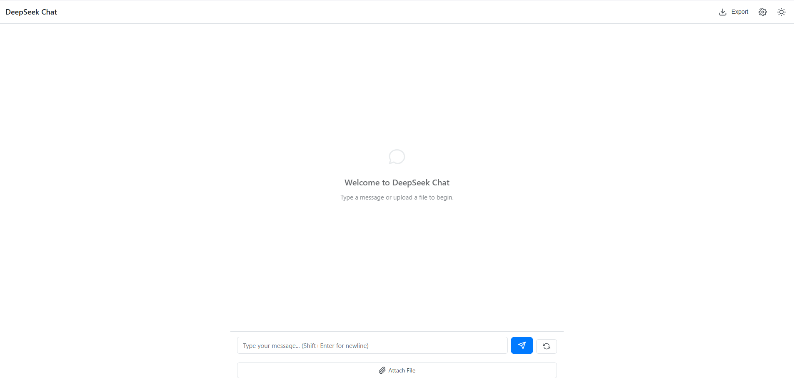

# DeepSeek Wrapper

---

[](https://github.com/TMHSDigital/DeepSeek-Wrapper/actions)
[](https://codecov.io/gh/TMHSDigital/DeepSeek-Wrapper)
[](docs/LICENSE)
[](https://www.python.org/downloads/)
[](https://results.pre-commit.ci/latest/github/TMHSDigital/DeepSeek-Wrapper/main)
[](https://github.com/TMHSDigital/DeepSeek-Wrapper/releases)

[](https://github.com/TMHSDigital/DeepSeek-Wrapper/issues)
[](https://github.com/TMHSDigital/DeepSeek-Wrapper/pulls)
[](https://github.com/TMHSDigital/DeepSeek-Wrapper/stargazers)
[](https://github.com/TMHSDigital/DeepSeek-Wrapper/network)
[](https://github.com/TMHSDigital/DeepSeek-Wrapper/commits/main)
[](https://pre-commit.com/)

---

> A modern, async/sync Python client for the DeepSeek LLM API. Supports completions, chat, retries, and robust error handling. Built for local dev, CI, and production.



## Documentation

| Doc | Description |
| --- | --- |
| [Getting Started](docs/getting-started.md) | Quick setup guide |
| [Web UI Guide](docs/web-ui-guide.md) | Guide to using the web interface |
| [Features](docs/features.md) | Detailed feature list |
| [API Reference](docs/api-reference.md) | API documentation for developers |
| [Deployment Guide](docs/deployment.md) | Deployment options and configurations |
| [FAQ](docs/faq.md) | Frequently asked questions |

For DeepSeek AI model capabilities, see [DeepSeek documentation](docs/deepseek-docs.md).

## Version Progress

Below are screenshots showing the evolution of the DeepSeek Wrapper web UI and features over time:

**Pre-release**


_Initial UI and feature set before public release._

<!-- Add more screenshots here as you add new versions, e.g.:
<p align="center">
  <strong style="font-size:1.2em;">v0.2.0</strong>
</p>
<p align="center">
  
</p>
<p align="center" style="font-size: 0.95em; color: #666;">
  <em>Added async endpoints and improved chat history.</em>
</p>
-->

**Tool Status & Caching Panel**


_See per-tool status, cache stats, and manage tool caches directly from the UI._

## Features

### Features

#### Modern API
- Sync & async support
- Type hints throughout
- Clean error handling

#### Advanced Web UI
- Session-based chat history
- Markdown rendering
- File uploads & processing

#### Real-Time Awareness
- Current date & time info
- Multiple formats (ISO, US, EU)
- No external API required

#### Production Ready
- Automatic retries with backoff
- 94%+ test coverage
- Environment variable config

#### Function Calling
- Tool integration framework
- Built-in tools (Weather, Calculator)
- Custom tool creation system
- Tool status dashboard: visualize tool health, API key status, and cache performance in real time

#### API Key Management
- Integrated settings panel
- Secure API key storage in .env
- Tool configuration UI

## Web UI (FastAPI)

A modern, session-based chat interface for DeepSeek, built with FastAPI and Jinja2.

**To run locally:**
```bash
uvicorn src.deepseek_wrapper.web:app --reload
```
Then open [http://localhost:8000](http://localhost:8000) in your browser.

**Web UI Features:**
- Chat with DeepSeek LLM (session-based history)
- Async backend for fast, non-blocking responses
- Reset conversation button
- Timestamps, avatars, and chat bubbles
- **Markdown rendering in assistant responses**
- Loading indicator while waiting for LLM
- **Non‑flashing "Thinking…" indicator with progress bar and optional expandable live details (accessibility-friendly)**
- Error banner for API issues
- **Tool configuration in settings panel with API key management**

Note on models:
- Default documented model: `deepseek-chat`
- You can change the runtime model via the REST API: `POST /api/set-model` (✓)
- The UI Model tab is informational for now (X) and won’t switch the backend model yet

For a comprehensive guide to using the web interface, see the [Web UI Guide](docs/web-ui-guide.md).

## Installation

```bash
pip install -r requirements.txt
pip install -e .  # for local development
```

### Quickstart (Web UI)

```powershell
python -m venv .venv
.\.venv\Scripts\Activate.ps1
pip install -r requirements.txt
"DEEPSEEK_API_KEY=sk-your-key" | Out-File -FilePath .env -Encoding ascii
uvicorn src.deepseek_wrapper.web:app --reload
```

For detailed installation instructions, see the [Getting Started Guide](docs/getting-started.md).

## Usage (Python)

```python
from deepseek_wrapper import DeepSeekClient
client = DeepSeekClient()
result = client.generate_text("Hello world!", max_tokens=32)
print(result)

# Async usage
import asyncio
async def main():
    result = await client.async_generate_text("Hello async world!", max_tokens=32)
    print(result)
# asyncio.run(main())
```

### Real-Time Date Awareness

```python
from deepseek_wrapper import DeepSeekClient
from deepseek_wrapper.utils import get_realtime_info

# Get real-time date information as JSON
realtime_data = get_realtime_info()
print(realtime_data)  # Prints current date in multiple formats

# Create a client with real-time awareness
client = DeepSeekClient()

# Use in a system prompt
system_prompt = f"""You are a helpful assistant with real-time awareness.
Current date and time information:
{realtime_data}
"""

# Send a message with the real-time-aware system prompt
messages = [
    {"role": "system", "content": system_prompt},
    {"role": "user", "content": "What's today's date?"}
]

response = client.chat_completion(messages)
print(response)  # Will include the current date
```

### Function Calling with Tools

```python
from deepseek_wrapper import DeepSeekClient, DateTimeTool, WeatherTool, CalculatorTool

# Create a client and register tools
client = DeepSeekClient()
client.register_tool(DateTimeTool())
client.register_tool(WeatherTool())
client.register_tool(CalculatorTool())

# Create a conversation
messages = [
    {"role": "user", "content": "What's the weather in London today? Also, what's the square root of 144?"}
]

# Get a response with tool usage
response, tool_usage = client.chat_completion_with_tools(messages)

# Print the final response
print(response)

# See which tools were used
for tool in tool_usage:
    print(f"Used {tool['tool']} with args: {tool['arguments']}")
```

For a complete API reference and advanced usage, see the [API Reference](docs/api-reference.md).

## Configuration
- Set `DEEPSEEK_API_KEY` in your `.env` or environment
- Optionally set `DEEPSEEK_BASE_URL`, `timeout`, `max_retries`
- See `.env.example`

**Default model:** `deepseek-chat` (per DeepSeek docs)

For deployment options and environment configurations, see the [Deployment Guide](docs/deployment.md).

## API Reference
All methods accept extra keyword args for model parameters (e.g., `temperature`, `top_p`, etc).

## Testing

```bash
pytest --cov=src/deepseek_wrapper
```

## Contributing

- Run `pre-commit install` to enable hooks

## Links
- [DeepSeek API Docs](https://platform.deepseek.com/docs)
- [OpenAI API Reference](https://platform.openai.com/docs/api-reference)
- [GitHub Repo](https://github.com/TMHSDigital/DeepSeek-Wrapper)

## License

Licensed under the Apache-2.0 license. See [docs/LICENSE](docs/LICENSE).

## Model Selection (Coming Soon)

> **Note:** The model selection feature is currently under development and **IS NOT functional yet**. 

The DeepSeek Wrapper will soon support switching between different DeepSeek models:
- deepseek-chat
- deepseek-coder
- deepseek-llm-67b-chat
- deepseek-llm-7b-chat
- deepseek-reasoner

When complete, users will be able to:
1. Select different models through the settings panel
2. See the currently active model in the UI
3. Configure model-specific settings, such as extracting only final answers from reasoning models
