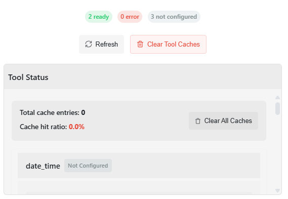

# Features

  <h3>A comprehensive set of features designed to enhance your interaction with DeepSeek AI models</h3>

## Features

  

    <h3 style="color: #4A90E2; margin-top: 0;">Modern API</h3>
    <ul>
      <li><b>Sync & async support</b></li>
      <li><b>Type hints throughout</b></li>
      <li><b>Clean error handling</b></li>
    </ul>
  

  
  

    <h3 style="color: #50C878; margin-top: 0;">Advanced Web UI</h3>
    <ul>
      <li><b>Session-based chat history</b></li>
      <li><b>Markdown rendering</b></li>
      <li><b>File uploads & processing</b></li>
    </ul>
  

  
  

    <h3 style="color: #FF6B6B; margin-top: 0;">Production Ready</h3>
    <ul>
      <li><b>Comprehensive logging</b> (✓)</li>
      <li><b>Request retry logic</b> (✓)</li>
      <li><b>Auto-scaling handling</b> (X via infrastructure)</li>
    </ul>
  

  

    

      <h3 style="margin: 0; color: white;">Real-Time Awareness</h3>
    

    

      <ul>
        <li>Current date and time information</li>
        <li>Multiple time formats (ISO, US, EU, natural language)</li>
        <li>Day of week, month, and year awareness</li>
        <li>Timezone support (local and UTC)</li>
        <li>Automatic injection into system prompts</li>
      </ul>
    

  

  

    

      <h3 style="margin: 0; color: white;">Tool Integration Framework</h3>
    

    

      <ul>
        <li>AI-powered function calling capabilities</li>
        <li>Extensible tool registry system</li>
        <li>Built-in tools for common tasks</li>
        <li>API integrations (Weather, Web Search, Wolfram Alpha)</li>
        <li>Custom tool creation framework</li>
      </ul>
    

  

## Advanced Features

  

    

      <h3 style="margin: 0; color: white;">Document Processing</h3>
    

    

      <ul>
        <li>File upload support for contextual conversations</li>
        <li>Text extraction from multiple file formats:
          <ul>
            <li>PDF documents</li>
            <li>Microsoft Word (DOCX) files</li>
            <li>Plain text (TXT) files</li>
          </ul>
        </li>
        <li>Content injection into conversation context</li>
      </ul>
    

  

  
  

    

      <h3 style="margin: 0; color: white;">Customization</h3>
    

    

      <ul>
        <li>User profile settings (name, avatar)</li>
        <li>Customizable system prompts</li>
        <li>UI theme customization options</li>
        <li>Adjustable chat behavior preferences</li>
      </ul>
    

  

  
  

    

      <h3 style="margin: 0; color: white;">Developer Tools</h3>
    

    

      <ul>
        <li>Clean Python API for programmatic access</li>
        <li>FastAPI backend with well-documented endpoints</li>
        <li>Proper error handling and logging</li>
        <li>Session management for reliable connections</li>
        <li>Streaming support via Server-Sent Events (SSE)</li>
      </ul>
    

  

## Performance Features

  

    <h3 style="color: #4A90E2; border-bottom: 2px solid #4A90E2; padding-bottom: 5px;">Optimizations</h3>
    <ul>
      <li>Efficient token handling to minimize API costs</li>
      <li>Response streaming for faster perceived performance</li>
      <li>Lightweight frontend for smooth operation on various devices</li>
      <li>Proper JSON chunk handling for reliable streaming</li>
    </ul>
  

  
  

    <h3 style="color: #FF6B6B; border-bottom: 2px solid #FF6B6B; padding-bottom: 5px;">Security</h3>
    <ul>
      <li>Environment-based configuration for secure API key storage (✓)</li>
      <li>Input validation and sanitization to prevent injection attacks (partial ✓)</li>
      <li>Secure file handling for uploads with size and type validation (partial ✓)</li>
      <li>HTTPS-only communications with the DeepSeek API (X — configure at deployment/proxy)</li>
      <li>Rate limiting to prevent abuse (X overall; Weather tool has internal limiter ✓)</li>
      <li>Content validation to filter potentially harmful outputs (X)</li>
      <li>Automatic session expiration for inactive users (X)</li>
    </ul>
  

## UI Enhancements

  

    <h3 style="color: #4A90E2; margin-top: 0;">Usability</h3>
    <ul>
      <li>Responsive design for desktop and mobile devices</li>
      <li>Keyboard shortcuts for common actions</li>
      <li>Copy functionality for code blocks</li>
      <li>Scroll-to-bottom button for long conversations</li>
    </ul>
  

  
  

    <h3 style="color: #50C878; margin-top: 0;">Visual Elements</h3>
    <ul>
      <li>Syntax highlighting for code using highlight.js</li>
      <li>Markdown rendering via Marked.js</li>
      <li>Distinct visual styling for user and AI messages</li>
      <li>Loading indicators during processing</li>
    </ul>
  

## Integration Features

  <h3 style="color: #9370DB; margin-top: 0;">Extensibility</h3>
  <ul>
    <li>Modular architecture for easy extension</li>
    <li>Webhook support for integration with other systems</li>
    <li>Customizable authentication methods</li>
    <li>Plugin architecture (planned)</li>
  </ul>

## Feature Details

### Real-Time Date Awareness

The DeepSeek Wrapper includes comprehensive real-time date awareness, providing accurate current date and time information to the model in multiple formats. This feature ensures the AI always knows the current date, day of the week, month, and year, allowing for more contextually appropriate responses.

The real-time information is automatically injected into system prompts, so the model is always aware of the current date without requiring explicit user queries. This is especially useful for questions about current events, scheduling, and any date-dependent information.

**Example outputs:**
- Today's date: May 17, 2025
- Current day: Saturday
- Current month and year: May 2025
- US date format: 05/17/2025
- EU date format: 17/05/2025
- ISO format: 2025-05-17T14:30:45

### Tool Integration Framework

The DeepSeek Wrapper includes a powerful and extensible tool integration framework that enables the AI to perform real-world actions and access external data sources. This function calling capability allows the AI to use tools when needed to provide more accurate, up-to-date information.

The framework includes built-in tools for common tasks:
- **DateTimeTool**: Access current date and time in various formats and timezones
- **CalculatorTool**: Perform complex mathematical calculations
- **WeatherTool**: Get current weather conditions and forecasts for any location
- **WebSearchTool**: Search the web for real-time information
- **WolframAlphaTool**: Access computational knowledge for advanced queries

The system is designed to be easily extensible, allowing developers to create custom tools by extending the base Tool class. The AI can intelligently decide when to use tools based on user queries, creating a more capable and responsive assistant.

**Example use cases:**
- Calculate complex mathematical expressions
- Get weather forecasts for travel planning
- Access real-time information for current events
- Convert between units and currencies
- Answer knowledge-based questions with factual data

### API Key Management and Tool Configuration

The DeepSeek Wrapper provides an intuitive, user-friendly interface for managing API keys and configuring tools directly from the web UI. This feature allows users to enable, disable, and configure various AI tools without needing to edit configuration files manually.

Key features of the tool configuration system:
- **Integrated settings panel**: Configure tools directly from the chat interface
- **Toggle controls**: Easily enable or disable individual tools
- **Secure API key storage**: API keys are saved in the server's `.env` file, not in browser storage
- **Immediate activation**: Tools become available as soon as API keys are saved
- **Environment variable integration**: Configuration automatically updates environment variables

The tool configuration panel is accessible from the settings menu and provides a complete overview of all available tools, their current status, and required API credentials. This makes it easy for users to manage which capabilities are available to the AI assistant.

**Configuration options include:**
- Web Search API keys for accessing real-time information
- Weather API credentials for forecasts and current conditions
- Email SMTP server settings for sending messages
- Toggle controls for built-in tools that don't require API keys

This user-friendly approach to tool configuration significantly improves the accessibility of advanced features, allowing non-technical users to fully utilize the AI's capabilities without developer assistance.

### Tool Caching and Status Monitoring

  
  
<i>Enhanced tool status and caching panel, showing per-tool status, cache stats, and management controls.</i>

The DeepSeek Wrapper includes an advanced tool caching and status monitoring system that enhances performance and provides comprehensive visibility into the tool ecosystem.

Key features of the tool caching system:
- **Intelligent caching**: Automatically caches tool results based on input parameters
- **Configurable TTL**: Time-to-live settings define how long cached results remain valid
- **Cache statistics**: Detailed hit/miss metrics for performance monitoring
- **Automatic cleanup**: Expired cache entries are automatically removed
- **Manual control**: Clear individual or all tool caches directly from the UI

The status monitoring system provides:
- **Real-time tool status**: See which tools are ready, in error state, or not configured
- **API key validation**: Automatic checking of API key validity
- **Usage monitoring**: Track when tools were last used
- **Cache visibility**: View cache size and performance metrics for each tool
- **Visual indicators**: Color-coded status badges show tool health at a glance

This comprehensive monitoring and caching system improves both performance and reliability:
- **Reduced API costs**: Fewer redundant API calls to external services
- **Faster responses**: Cached results return instantly without external API calls
- **Rate limit protection**: Minimizes chances of hitting API rate limits
- **Better debugging**: Clear visibility into tool status helps troubleshoot issues
- **Enhanced reliability**: Retries and error handling improve overall stability

The entire system is accessible through an intuitive UI panel, allowing non-technical users to monitor and manage tool performance without developer assistance. 