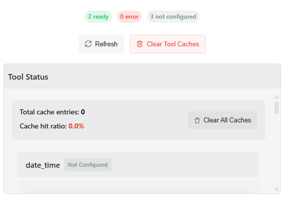

# Web UI Guide

The DeepSeek Wrapper provides a modern, feature-rich chat interface for interacting with DeepSeek AI models.

## Interface Overview

<div align="center">
  
  <div style="font-size: 0.95em; color: #666; margin-top: 0.5em;"><i>Main chat interface layout, showing chat area, input, settings, file upload, and conversation history.</i></div>
</div>

The interface consists of several key components:
- **Chat Area**: The main area where conversations are displayed
- **Input Box**: Where you type your messages
- **Settings Button**: Access to customize your experience
- **File Upload**: Button to upload documents for context
- **Conversation History**: List of your previous conversations
 - **Command Palette**: Press Ctrl+K to access quick actions

## Starting a New Chat

1. When you first open the application, you'll see an empty chat
2. Type your message in the input box at the bottom of the screen
3. Press Enter or click the send button to submit your message
4. The AI will respond in the chat area

## Chat Features

### Markdown Support

The chat interface supports full Markdown formatting, including:
- **Bold**, *italic*, and ~~strikethrough~~ text
- Code blocks with syntax highlighting
- Lists and tables
- Links and images

### Code Handling

Code snippets use lazy-loaded syntax highlighting for faster initial loads. You can:
- Copy code blocks with a single click on the copy button
- See the language identified in the top-right of each code block
### Date Separators and Virtualized History

Long conversations are easier to scan with automatic date separators. For performance, the UI shows only the most recent portion of the conversation by default. Use the “Load older messages” button to reveal earlier messages. You can configure how many messages remain visible (30/50/100) in Settings → Appearance.

### Command Palette

Press Ctrl+K to open the command palette for quick actions such as toggling theme, opening Settings, exporting, or focusing the input.

### Accessibility and Motion Preferences

Under Settings → Appearance you can enable Reduced Motion to disable animations, and toggle timestamps or compact density. The “Thinking…” details panel disables animations when expanded.

### Streaming UX: Safe Thinking Indicator

To reduce flashing and improve readability while the model is generating a response, the UI now uses a non-flashing "Thinking…" indicator:

- A subtle progress bar communicates activity without strobing effects
- A "Show details" toggle lets you expand a collapsible panel to view the live, streaming content
- When expanded, all animations inside the details area are disabled to avoid visual flicker
- On completion, the details panel auto-expands once, the bar fills, and animations remain off

How to use:
1. Send a message as usual
2. While the model is thinking, click "Show details" to watch the response stream in real-time
3. Click "Hide details" to collapse the panel and keep the conversation compact

Accessibility notes:
- The previous blinking cursor and animated dots have been removed to minimize potential seizure risks
- The progress bar uses a gentle slide animation that is disabled when the details area is expanded
- The indicator and controls are keyboard- and screen-reader-friendly (progressbar, aria-expanded)

### Uploading Files

To provide context from a document:

1. Click the upload button next to the input field
2. Select a supported file (PDF, DOCX, or TXT)
3. Once uploaded, the content will be processed and included in your next message
4. You can reference the document in your query

<div align="center">
  
  <div style="font-size: 0.95em; color: #666; margin-top: 0.5em;"><i>File upload process and UI for providing document context.</i></div>
</div>

#### Supported File Types

| File Type | Extensions | Max Size | Notes |
|-----------|------------|----------|-------|
| PDF Documents | .pdf | 10 MB | Text extraction from all pages |
| Microsoft Word | .docx, .doc | 10 MB | Text extraction with basic formatting preserved |
| Plain Text | .txt, .md | 5 MB | Direct inclusion of text content |

#### Using Document Context

After uploading a document, you can reference it in your messages in various ways:

```
# Examples of document references
"Summarize the uploaded document."
"Extract the key points from the PDF I just shared."
"Answer questions based on the content in the document I uploaded."
"Using the uploaded resume, write a cover letter for a software engineer position."
```

The document content is automatically analyzed and included in the context for the AI model, making it accessible for the conversation without needing to copy and paste the text manually.

#### Security Notes

- Documents are processed on the server but are not permanently stored
- Content is extracted and used only for the current session
- X Malware/sensitive content scanning (planned)
- X Automatic expiry after 24 hours (planned)

## Customizing Your Experience

### Profile Settings

1. Click the settings icon in the top right corner
2. In the modal, you can:
   - Set your display name
   - Choose or upload an avatar
   - Configure system prompts
   - Adjust UI preferences

<div align="center">
  
  <div style="font-size: 0.95em; color: #666; margin-top: 0.5em;"><i>General settings modal for profile, avatar, and system prompt configuration.</i></div>
</div>

#### User Profile Options

| Setting | Description | Default |
|---------|-------------|---------|
| Display Name | Name shown in the chat interface | "User" |
| Avatar | Profile picture shown with your messages | Default avatar |
| Theme | Light, Dark, or System-based | System |
| Message Density | Compact or Comfortable view | Comfortable |
| Code Font Size | Size of text in code blocks | Medium |
| Save History | Whether to save conversation history | Enabled |

### System Prompts

System prompts help guide the AI's behavior:

1. Access system prompt settings via the settings modal
2. Enter your custom system prompt or select from templates
3. Save your changes
4. New conversations will use your custom system prompt

#### System Prompt Templates

The DeepSeek Wrapper includes several pre-built system prompt templates for common use cases:

- **Default Assistant**: General-purpose AI assistant
- **Code Helper**: Specialized for programming assistance
- **Writing Assistant**: Optimized for content creation and editing
- **Data Analyst**: Focused on data analysis and interpretation
- **Teacher**: Designed for educational explanations
- **Brainstorming Partner**: Optimized for creative ideation

#### Custom System Prompt Tips

For best results with custom system prompts:

- Be specific about the AI's role and expertise
- Describe the tone and style you prefer
- Specify any limitations or focus areas
- Keep prompts concise but descriptive
- Include examples of desired behavior when possible

Example custom system prompt:
```
You are a professional software developer with expertise in Python and JavaScript. 
Provide detailed, well-structured code examples with clear explanations. 
Focus on writing efficient, readable code following best practices. 
Include error handling in your examples when appropriate.
```

### Tool Configuration and API Keys

The DeepSeek Wrapper includes several AI tools that can be configured through the settings panel:

1. Click the settings icon in the top right corner
2. Switch to the "Tools" tab
3. Configure the available tools:
   - Enable or disable specific tools using the toggle switches
   - Enter API keys for tools that require external services
   - Configure additional settings for each tool (e.g., SMTP server for email)

<div align="center">
  
  <div style="font-size: 0.95em; color: #666; margin-top: 0.5em;"><i>Tools tab in the settings modal, with toggles and API key fields for each tool.</i></div>
</div>

#### Available Tools

| Tool | Description | API Key Required |
|------|-------------|------------------|
| Web Search | Search the web for real-time information | Yes (SEARCH_API_KEY) |
| Weather | Get current weather and forecasts | Yes (OPENWEATHERMAP_API_KEY) |
| Email | Compose and send emails | Yes (SMTP credentials) |
| Calculator | Perform calculations | No |
| Date & Time | Get current date and time information | No |

#### API Key Management

When you enter API keys in the tools configuration panel:

1. The keys are saved securely in your local `.env` file
2. Tools are automatically registered with the appropriate API keys
3. The AI can immediately use the configured tools in your conversations

This approach provides several benefits:
- API keys are stored securely on your server, not in the browser
- Configuration is persistent across server restarts
- No need to manually edit configuration files
- Tools can be easily enabled or disabled as needed

> **Note**: The API keys are stored in plaintext in your `.env` file. Ensure this file has appropriate permissions and is included in your `.gitignore` to prevent accidental exposure.

#### Using Tools in Conversations

Once tools are configured, you can use them in your conversations by asking questions that require their functionality:

- "What's the weather in Tokyo today?" (Weather tool)
- "Search the web for the latest AI research papers" (Web Search tool)
- "Help me draft an email to schedule a meeting" (Email tool)
- "What is the square root of 144?" (Calculator tool)
- "What's today's date?" (Date & Time tool)

The AI will automatically use the appropriate tool when needed to answer your questions.

#### Tool Status and Caching

<div align="center">
  
  <div style="font-size: 0.95em; color: #666; margin-top: 0.5em;"><i>Enhanced tool status and caching panel, showing per-tool status, cache stats, and management controls.</i></div>
</div>

The DeepSeek Wrapper includes a comprehensive tool status monitoring system and caching mechanism. These features enhance performance and provide better visibility into the tool system:

1. **Tool Status Panel**: The Tools tab includes a status panel showing:
   - Ready, error, and unconfigured tool counts
   - Detailed status for each registered tool
   - API key validation status
   - Last usage information

2. **Caching System**: Tools use an intelligent caching system to improve performance:
   - Reduces redundant API calls for identical requests
   - Configurable cache time-to-live (TTL) settings
   - Cache hit/miss statistics for performance monitoring
   - Automatic cleanup of expired cache entries

The caching system provides several benefits:
- Faster response times for repeated queries
- Reduced API usage and associated costs
- Less network traffic and lower latency
- Protection against rate limiting on external APIs

##### Managing Tool Caches

You can manage the tool caching system directly from the UI:

1. **View Cache Statistics**: See cache size, hit ratios, and history for each tool
2. **Clear Individual Caches**: Each tool has a dedicated cache clear button
3. **Clear All Caches**: Use the "Clear Tool Caches" button to reset all caches at once
4. **Refresh Tool Status**: Update the status display to see the latest information

> **Note**: Clearing the cache doesn't impact tool functionality but may result in slightly slower responses until the cache is rebuilt with new requests.

##### Cache Settings

The caching system uses these default settings:

| Setting | Default Value | Description |
|---------|---------------|-------------|
| Cache Enabled | Yes | Whether caching is active for each tool |
| Time-to-Live (TTL) | 300 seconds | How long cached results remain valid |
| Cache Key | Request parameters | What determines a cache hit/miss |

These settings provide an optimal balance between performance and freshness of information for most use cases.

#### Model Selection (Coming Soon)

<div align="center">
  <div style="font-size: 0.95em; color: #666; margin-top: 0.5em;"><i>⚠️ The model selection feature is currently under development and is not functional yet. ⚠️</i></div>
</div>

The DeepSeek Wrapper will soon support model selection, allowing you to choose from various DeepSeek models with different capabilities:

1. **Supported Models**: The system will support switching between:
   - deepseek-chat: General-purpose chat model (default)
   - deepseek-coder: Specialized for code generation and programming tasks
   - deepseek-llm-67b-chat: Larger model with enhanced capabilities
   - deepseek-llm-7b-chat: Smaller, faster model for simpler tasks
   - deepseek-reasoner: Model with enhanced reasoning capabilities

2. **Model Settings Panel**: A dedicated tab in the settings modal will offer:
   - Simple model selection UI
   - Model-specific configuration options
   - Performance and capability comparisons

3. **Model-Specific Features**: Special features tailored to each model:
   - For reasoning models: Option to show only final answers after processing
   - For code models: Enhanced syntax highlighting and code explanations
   - For larger models: Warning about potential longer response times

4. **Model Indicator**: A visual indicator in the UI will show which model is currently active

<div align="center">
  <div style="font-size: 0.95em; color: #FF6B6B; margin-top: 0.5em;"><i>Note: Configuration changes made in the Model tab will not affect the application until this feature is fully implemented.</i></div>
</div>

### Conversation Management

- **Starting a new conversation**: Click the "New Chat" button
- **Viewing history**: See previous conversations in the sidebar
- **Continuing a conversation**: Click on any previous conversation to resume it

## Keyboard Shortcuts

The DeepSeek Wrapper UI supports a range of keyboard shortcuts to improve productivity:

| Shortcut | Action | Description |
|----------|--------|-------------|
| `Enter` | Submit message | Send your message (when input isn't multi-line) |
| `Ctrl+Enter` / `Cmd+Enter` | Submit message | Send your message (always works) |
| `Shift+Enter` | New line | Add a line break in the input area |
| `Esc` | Cancel | Cancel current input or close modals |
| `Up Arrow` | Edit last message | Recall and edit your last message |
| `Ctrl+K` / `Cmd+K` | Quick actions | Open quick action menu |
| `Ctrl+/` / `Cmd+/` | Keyboard help | Show keyboard shortcut help |
| `Ctrl+N` / `Cmd+N` | New conversation | Start a new chat |
| `Ctrl+S` / `Cmd+S` | Save conversation | Save current conversation (if changed) |
| `Ctrl+F` / `Cmd+F` | Search | Search within the current conversation |
| `Ctrl+Backspace` / `Cmd+Backspace` | Delete word | Delete the word before cursor |
| `Alt+Left` / `Alt+Right` | Navigate history | Navigate between conversation history |
| `Tab` | Auto-complete | When typing code, attempts to auto-complete |
| `Ctrl+Z` / `Cmd+Z` | Undo | Undo last edit in input box |
| `Ctrl+Shift+Z` / `Cmd+Shift+Z` | Redo | Redo last undone edit |

These shortcuts can significantly enhance your workflow, especially when engaging in extended conversations or coding sessions.

## Mobile Usage

The interface is fully responsive and works on mobile devices:
- Swipe from the left edge to access conversation history on small screens
- All features are accessible through touch-friendly controls 