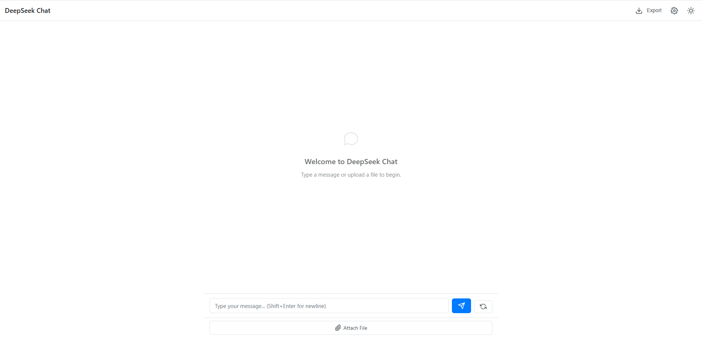
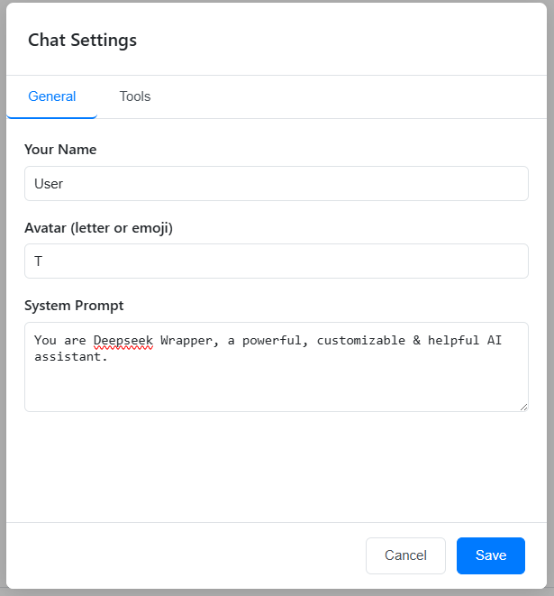
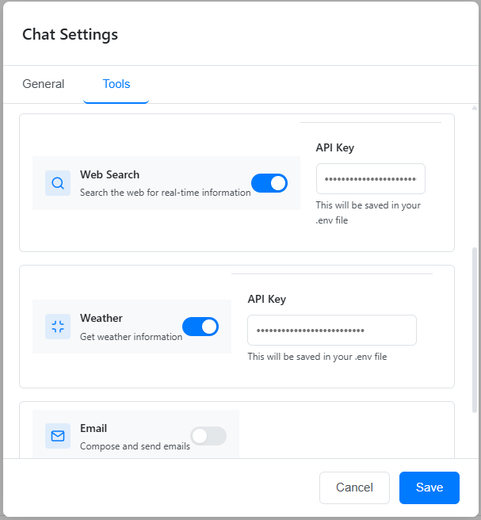

# Web UI Guide

The DeepSeek Wrapper provides a modern, feature-rich chat interface for interacting with DeepSeek AI models.

## Interface Overview



The interface consists of several key components:
- **Chat Area**: The main area where conversations are displayed
- **Input Box**: Where you type your messages
- **Settings Button**: Access to customize your experience
- **File Upload**: Button to upload documents for context
- **Conversation History**: List of your previous conversations

## Starting a New Chat

1. When you first open the application, you'll see an empty chat
2. Type your message in the input box at the bottom of the screen
3. Press Enter or click the send button to submit your message
4. The AI will respond in the chat area

## Chat Features

### Markdown Support

The chat interface supports full Markdown formatting, including:
- **Bold**, *italic*, and ~~strikethrough~~ text
- Code blocks with syntax highlighting
- Lists and tables
- Links and images

### Code Handling

Code snippets are displayed with syntax highlighting for better readability. You can:
- Copy code blocks with a single click on the copy button
- See the language identified in the top-right of each code block

### Uploading Files

To provide context from a document:

1. Click the upload button next to the input field
2. Select a supported file (PDF, DOCX, or TXT)
3. Once uploaded, the content will be processed and included in your next message
4. You can reference the document in your query


#### Supported File Types

| File Type | Extensions | Max Size | Notes |
|-----------|------------|----------|-------|
| PDF Documents | .pdf | 10 MB | Text extraction from all pages |
| Microsoft Word | .docx, .doc | 10 MB | Text extraction with basic formatting preserved |
| Plain Text | .txt, .md | 5 MB | Direct inclusion of text content |

#### Using Document Context

After uploading a document, you can reference it in your messages in various ways:

```
# Examples of document references
"Summarize the uploaded document."
"Extract the key points from the PDF I just shared."
"Answer questions based on the content in the document I uploaded."
"Using the uploaded resume, write a cover letter for a software engineer position."
```

The document content is automatically analyzed and included in the context for the AI model, making it accessible for the conversation without needing to copy and paste the text manually.

#### Security Notes

- Documents are processed on the server but are not permanently stored
- Content is extracted and used only for the current session
- File uploads are scanned for malware and sensitive content
- Uploads expire after 24 hours or when the session ends

## Customizing Your Experience

### Profile Settings

1. Click the settings icon in the top right corner
2. In the modal, you can:
   - Set your display name
   - Choose or upload an avatar
   - Configure system prompts
   - Adjust UI preferences



#### User Profile Options

| Setting | Description | Default |
|---------|-------------|---------|
| Display Name | Name shown in the chat interface | "User" |
| Avatar | Profile picture shown with your messages | Default avatar |
| Theme | Light, Dark, or System-based | System |
| Message Density | Compact or Comfortable view | Comfortable |
| Code Font Size | Size of text in code blocks | Medium |
| Save History | Whether to save conversation history | Enabled |

### System Prompts

System prompts help guide the AI's behavior:

1. Access system prompt settings via the settings modal
2. Enter your custom system prompt or select from templates
3. Save your changes
4. New conversations will use your custom system prompt

#### System Prompt Templates

The DeepSeek Wrapper includes several pre-built system prompt templates for common use cases:

- **Default Assistant**: General-purpose AI assistant
- **Code Helper**: Specialized for programming assistance
- **Writing Assistant**: Optimized for content creation and editing
- **Data Analyst**: Focused on data analysis and interpretation
- **Teacher**: Designed for educational explanations
- **Brainstorming Partner**: Optimized for creative ideation

#### Custom System Prompt Tips

For best results with custom system prompts:

- Be specific about the AI's role and expertise
- Describe the tone and style you prefer
- Specify any limitations or focus areas
- Keep prompts concise but descriptive
- Include examples of desired behavior when possible

Example custom system prompt:
```
You are a professional software developer with expertise in Python and JavaScript. 
Provide detailed, well-structured code examples with clear explanations. 
Focus on writing efficient, readable code following best practices. 
Include error handling in your examples when appropriate.
```

### Tool Configuration and API Keys

The DeepSeek Wrapper includes several AI tools that can be configured through the settings panel:

1. Click the settings icon in the top right corner
2. Switch to the "Tools" tab
3. Configure the available tools:
   - Enable or disable specific tools using the toggle switches
   - Enter API keys for tools that require external services
   - Configure additional settings for each tool (e.g., SMTP server for email)



#### Available Tools

| Tool | Description | API Key Required |
|------|-------------|------------------|
| Web Search | Search the web for real-time information | Yes (WEBSEARCH_API_KEY) |
| Weather | Get current weather and forecasts | Yes (WEATHER_API_KEY) |
| Email | Compose and send emails | Yes (SMTP credentials) |
| Calculator | Perform calculations | No |
| Date & Time | Get current date and time information | No |

#### API Key Management

When you enter API keys in the tools configuration panel:

1. The keys are saved securely in your local `.env` file
2. Tools are automatically registered with the appropriate API keys
3. The AI can immediately use the configured tools in your conversations

This approach provides several benefits:
- API keys are stored securely on your server, not in the browser
- Configuration is persistent across server restarts
- No need to manually edit configuration files
- Tools can be easily enabled or disabled as needed

> **Note**: The API keys are stored in plaintext in your `.env` file. Ensure this file has appropriate permissions and is included in your `.gitignore` to prevent accidental exposure.

#### Using Tools in Conversations

Once tools are configured, you can use them in your conversations by asking questions that require their functionality:

- "What's the weather in Tokyo today?" (Weather tool)
- "Search the web for the latest AI research papers" (Web Search tool)
- "Help me draft an email to schedule a meeting" (Email tool)
- "What is the square root of 144?" (Calculator tool)
- "What's today's date?" (Date & Time tool)

The AI will automatically use the appropriate tool when needed to answer your questions.

### Conversation Management

- **Starting a new conversation**: Click the "New Chat" button
- **Viewing history**: See previous conversations in the sidebar
- **Continuing a conversation**: Click on any previous conversation to resume it

## Keyboard Shortcuts

The DeepSeek Wrapper UI supports a range of keyboard shortcuts to improve productivity:

| Shortcut | Action | Description |
|----------|--------|-------------|
| `Enter` | Submit message | Send your message (when input isn't multi-line) |
| `Ctrl+Enter` / `Cmd+Enter` | Submit message | Send your message (always works) |
| `Shift+Enter` | New line | Add a line break in the input area |
| `Esc` | Cancel | Cancel current input or close modals |
| `Up Arrow` | Edit last message | Recall and edit your last message |
| `Ctrl+K` / `Cmd+K` | Quick actions | Open quick action menu |
| `Ctrl+/` / `Cmd+/` | Keyboard help | Show keyboard shortcut help |
| `Ctrl+N` / `Cmd+N` | New conversation | Start a new chat |
| `Ctrl+S` / `Cmd+S` | Save conversation | Save current conversation (if changed) |
| `Ctrl+F` / `Cmd+F` | Search | Search within the current conversation |
| `Ctrl+Backspace` / `Cmd+Backspace` | Delete word | Delete the word before cursor |
| `Alt+Left` / `Alt+Right` | Navigate history | Navigate between conversation history |
| `Tab` | Auto-complete | When typing code, attempts to auto-complete |
| `Ctrl+Z` / `Cmd+Z` | Undo | Undo last edit in input box |
| `Ctrl+Shift+Z` / `Cmd+Shift+Z` | Redo | Redo last undone edit |

These shortcuts can significantly enhance your workflow, especially when engaging in extended conversations or coding sessions.

## Mobile Usage

The interface is fully responsive and works on mobile devices:
- Swipe from the left edge to access conversation history on small screens
- All features are accessible through touch-friendly controls 